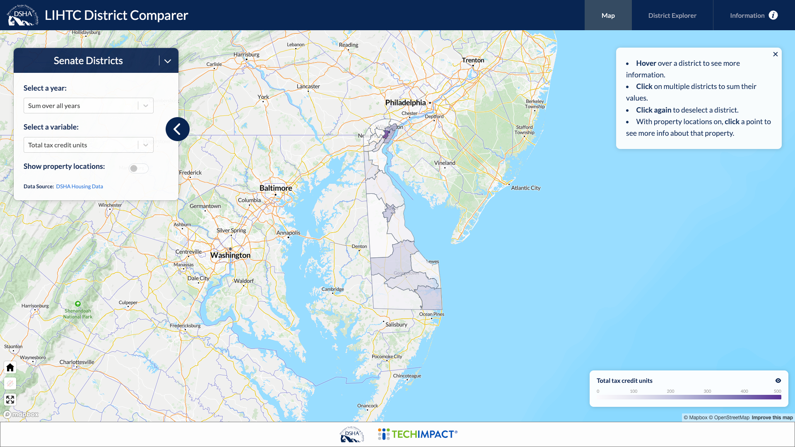
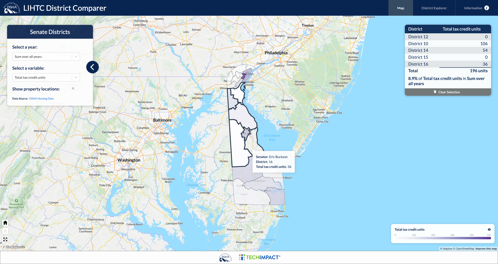
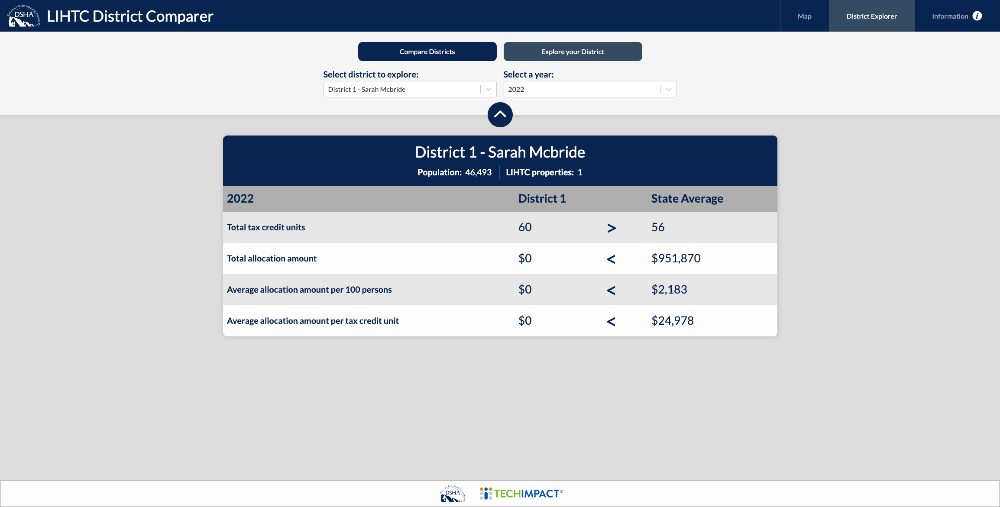
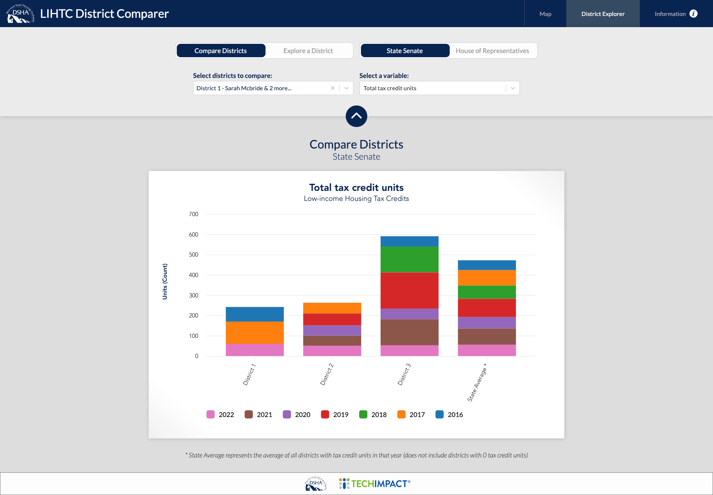
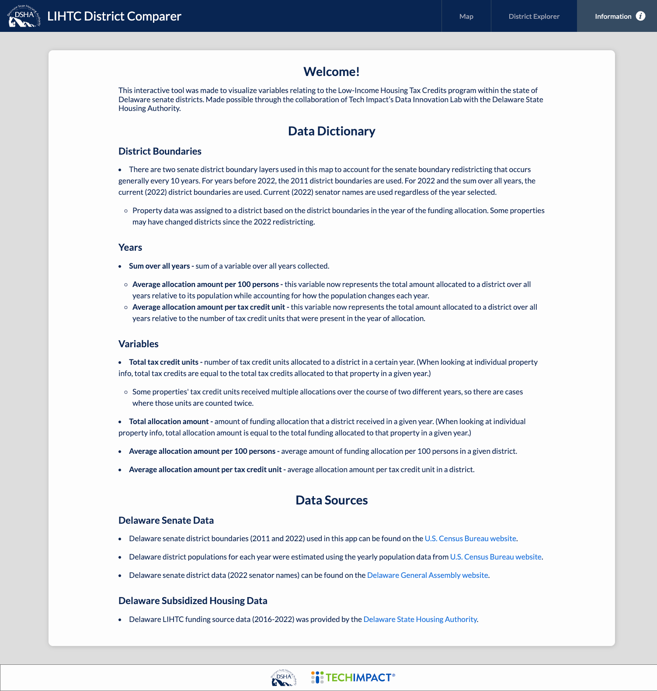

# DSHA's LIHTC District Comparer

## About this App

This app was developed for the Delaware State Housing Authority and state of Delaware Legislators to visualize variables relating to the Low-Income Housing Tax Credits program within the state of Delaware Senate Districts. Made possible through the collaboration of Tech Impact’s Data Innovation Lab with the Delaware State Housing Authority.

## Running App

#### To run this app locally:
1. Install the needed dependencies by running `npm i`
2. Run `npm start` to run the app

## About the Data

### Delaware Senate Data
- Delaware senate district boundaries (2011 and 2022) used in this app can be found on the [U.S. Census Bureau website](https://www2.census.gov/geo/tiger/GENZ2022).
- Delaware district populations for each year were estimated using the 5-year "period" estimates from the [American Community Survey](https://www.census.gov/data/developers/data-sets/acs-5year.html).
- Delaware senate district data (2022 senator names) can be found on the [Delaware General Assembly website](https://legis.delaware.gov/Redistricting/2022FinalSenateDistricts).

### Delaware Subsidized Housing Data
- Delaware LIHTC funding source data (2016-2022) was provided by the [Delaware State Housing Authority](http://www.destatehousing.com).

## Screenshots

<!-- 

 -->

## Badges

## License 
GNU Affero General Public License v3.0

